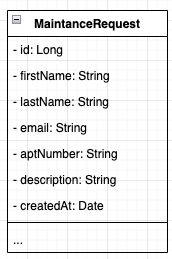

# Code Differently Apts Maintanence Request Form

## Part 1
You are a developer for Code Differently Apartments, and you are tasked with creating a Fullstack web solution to handle maintaence request from tenents. You are first going to create the backend API to collect the data in Part 1.

A maintanence request object should look like the following :



Where the `MaintanenceRequest` model should have :

* id - its position in the database
* firstName - first name of tenent making the request
* lastName - last name of tenent making the request
* email - email request of tenent making the request
* aptNumber - Apartment number of the tenent making the request
* description - description of the request for maintanence
* createAt - time stamp of when the request was made.


## Step 01 :

Create a new Spring App called `maintanence-request-server`

Make sure you have the following dependences:

* Web - Spring Web handles web request
* Lombok - Simplfies creating models
* JPA - Java Persistence API
* H2 - The Database

## Step 02 :

Create the full application with the following structure
 
```
maintanence-request-server
├── README.md
├── pom.xml
├── package.json
├── .gitignore
├── public
└── src
	└── main
		└── java
			└── com.<your-info>.maintanencerequestserver
		  		├── MaintanenceRequestServerApplication
			  	└── domain
			  		├── core
			  			└──exceptions
				  			├── ResourceCreationException
				  			└── ResourceNotFoundException
			  		└── maintenceRequest
			  			└── models
			  				└── MaintenceRequest
		  				└── services
		  					├── MaintenceRequestService
		  					└── MaintenceRequestServiceImpl
	  					└── repos
	  						└── MaintenceRequestRepo
  						└── controllers
  							└── MaintenceRequestController

```

## Step 03 :

Run your program and test it using PostMan.