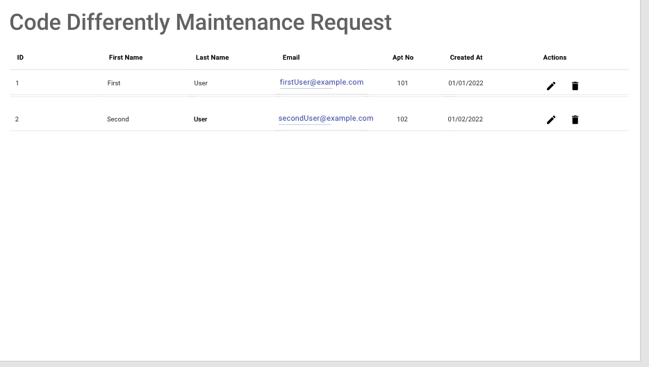
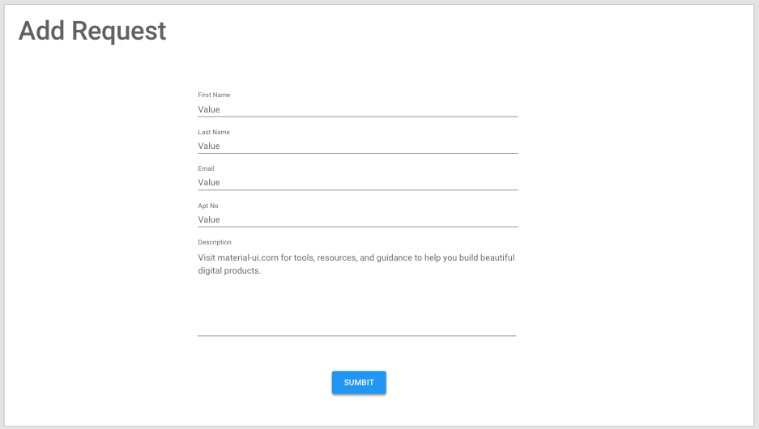
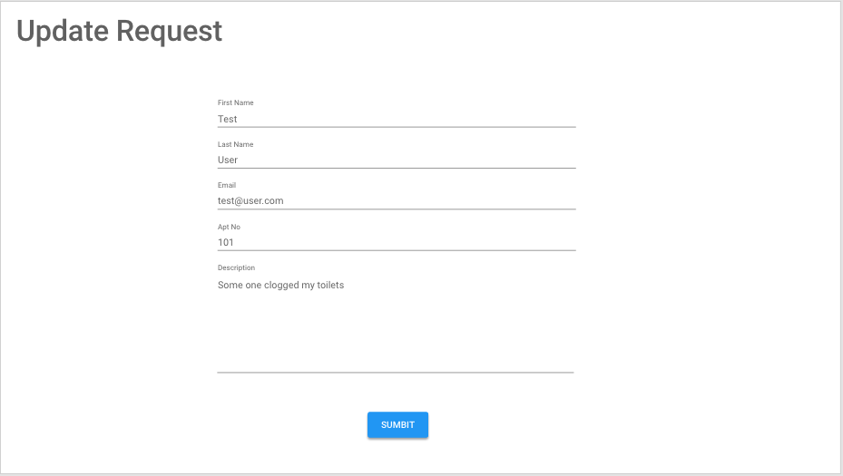

# Code Differently Apts Maintanence Request Form

## Part 2

Before attempting to do this , you should have completed Part 1. The objective here is to build a react app client for our backend in spring.

The client should have 3 main screens

### Request Page



### Add Request Page


#### Update Request Page



### This is the suggested File Structure
```
maintanence-request-client
├── README.md
├── package.json
├── public
└── src
	└── components
		└── RequestTable.js
  		└──pages
	  			├── AddRequest.js
	  			├── Requests.js
	  			├── NoContent.js
	  			└── UpdateRequest.js
  		└── services
  			└── RequestService.js
```	

> Dont forget to push to github!!!!