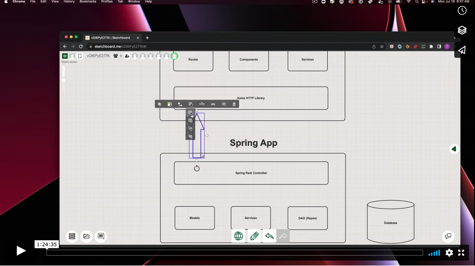
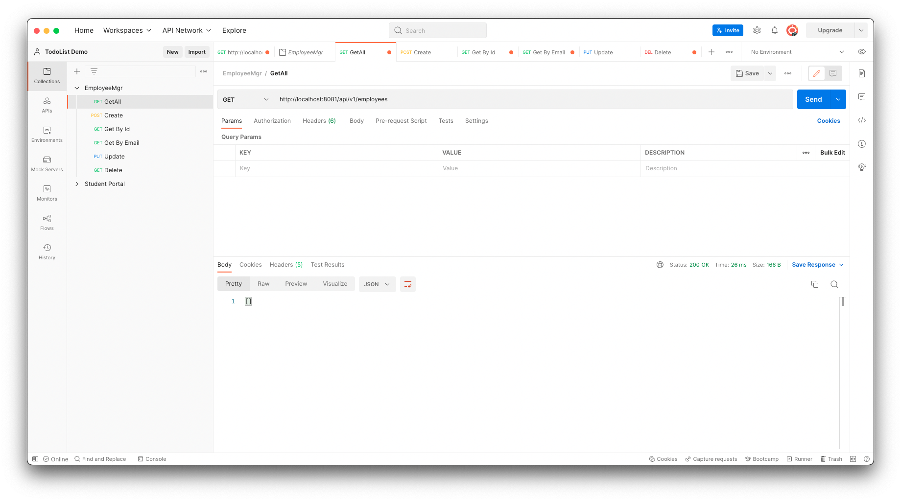
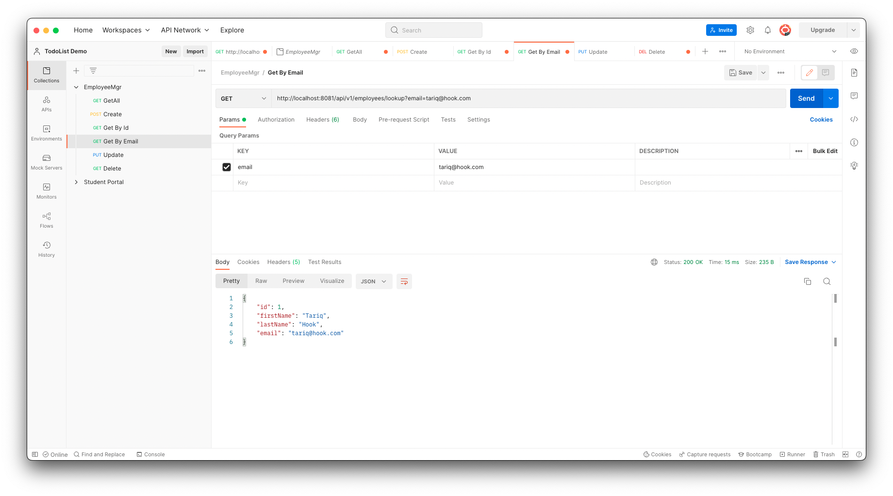
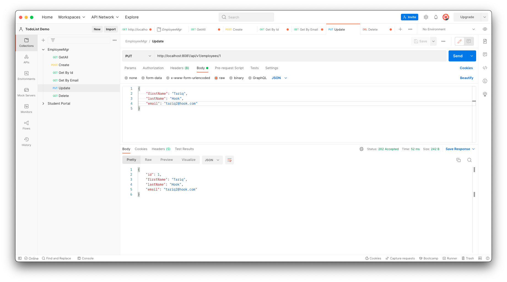

# Spring Boot React Full-Stack Architecture


## What we will build

We will build a full-stack web application that is a basic Employee Management Application with CRUD features:

* Create Employee
* List Employee
* Update Employee
* Delete Employee

## Server-side tools and technologies used
* Spring Boot 2 +
* SpringData JPA ( Hibernate)
* Maven 3.2 +
* JDK 1.8
* Embedded Tomcat 8.5+
* MySQL Database


## Video Walkthrough



[Watch Video Here](https://vimeo.com/731057905)

## 1. Create Spring boot application

Spring Boot provides a web tool called Spring Initializer to bootstrap an application quickly. Just go to [https://start.spring.io/](https://start.spring.io/) and generate a new spring boot project.


Use the below details in the Spring boot creation:

**Project Name:** employee-mgr-server

**Project Type:** Maven

**Choose dependencies:** Spring Web, Lombok, Spring Data JPA, and H2 Database

**Package name:** com.codedifferently

**Packaging:** Jar

**Java** : 11

Download Spring Boot project as a zip file, unzip it, and import it into IntelliJ IDEA.

Here is the pom.xml file for your reference:

```
<?xml version="1.0" encoding="UTF-8"?>
<project xmlns="http://maven.apache.org/POM/4.0.0" xmlns:xsi="http://www.w3.org/2001/XMLSchema-instance"
	xsi:schemaLocation="http://maven.apache.org/POM/4.0.0 https://maven.apache.org/xsd/maven-4.0.0.xsd">
	<modelVersion>4.0.0</modelVersion>
	<parent>
		<groupId>org.springframework.boot</groupId>
		<artifactId>spring-boot-starter-parent</artifactId>
		<version>2.7.1</version>
		<relativePath/> <!-- lookup parent from repository -->
	</parent>
	<groupId>com.36chambers</groupId>
	<artifactId>employee-mgr-server</artifactId>
	<version>0.0.1-SNAPSHOT</version>
	<name>employee-mgr-server</name>
	<description>Demo project for Spring Boot</description>
	<properties>
		<java.version>11</java.version>
	</properties>
	<dependencies>
		<dependency>
			<groupId>org.springframework.boot</groupId>
			<artifactId>spring-boot-starter-data-jpa</artifactId>
		</dependency>
		<dependency>
			<groupId>org.springframework.boot</groupId>
			<artifactId>spring-boot-starter-web</artifactId>
		</dependency>

		<dependency>
			<groupId>org.springframework.boot</groupId>
			<artifactId>spring-boot-devtools</artifactId>
			<scope>runtime</scope>
			<optional>true</optional>
		</dependency>
		<dependency>
			<groupId>com.h2database</groupId>
			<artifactId>h2</artifactId>
			<scope>runtime</scope>
		</dependency>
		<dependency>
			<groupId>org.projectlombok</groupId>
			<artifactId>lombok</artifactId>
			<optional>true</optional>
		</dependency>
		<dependency>
			<groupId>org.springframework.boot</groupId>
			<artifactId>spring-boot-starter-test</artifactId>
			<scope>test</scope>
		</dependency>
	</dependencies>

	<build>
		<plugins>
			<plugin>
				<groupId>org.springframework.boot</groupId>
				<artifactId>spring-boot-maven-plugin</artifactId>
				<configuration>
					<excludes>
						<exclude>
							<groupId>org.projectlombok</groupId>
							<artifactId>lombok</artifactId>
						</exclude>
					</excludes>
				</configuration>
			</plugin>
		</plugins>
	</build>

</project>

```

## 2. Create Project or Packaging Structure

You below screenshot to create a project or packaging structure for your Spring boot project:


## 3. Create JPA Entity

Go to `employee.model` package, create a class named Employee and add the following content into it:

```
package com.chambers.employeemgrserver.domain.employee.models;

import lombok.Data;
import lombok.NoArgsConstructor;
import lombok.NonNull;
import lombok.RequiredArgsConstructor;

import javax.persistence.Entity;
import javax.persistence.GeneratedValue;
import javax.persistence.GenerationType;
import javax.persistence.Id;

@Entity // JPA to save to the database
@NoArgsConstructor // Non argument constructor
@RequiredArgsConstructor // parameterized constructor
@Data // getters and setters
public class Employee {

    @Id
    @GeneratedValue(strategy = GenerationType.IDENTITY)
    private Long id;

    @NonNull
    private String firstName;

    @NonNull
    private String lastName;

    @NonNull
    private String email;

    public String toString(){
        return String.format("%d %s %s %s", id, firstName,lastName,email);
    }
}

```

## 4. Create Spring Data JPA Repository

No, we gonna create a Spring Data JPA repository to talk with the MySQL database.

Go to `employee.repository` package, create the following EmployeeRepository interface and add the following content to it:

```
package com.chambers.employeemgrserver.domain.employee.repos;

import com.chambers.employeemgrserver.domain.employee.models.Employee;
import org.springframework.data.jpa.repository.JpaRepository;

import java.util.Optional;

public interface EmployeeRepository extends JpaRepository<Employee, Long> {
    Optional<Employee> findByEmail(String email);
}

```

## 5. Create ResourceNotFoundException Custom Exception

Go to an `core.exception` package, create a class named ResourceNotFoundException and add the following content to it:

```
package com.chambers.employeemgrserver.domain.core.exceptions;

import org.springframework.http.HttpStatus;
import org.springframework.web.bind.annotation.ResponseStatus;

@ResponseStatus(value = HttpStatus.NOT_FOUND)
public class ResourceNotFoundException extends RuntimeException{
    public ResourceNotFoundException(String message) {
        super(message);
    }
}
```

## 6. Create ResourceCreationException Custom Exception

Go to an `core.exception` package, create a class named ResourceCreationException and add the following content to it:

```
package com.chambers.employeemgrserver.domain.core.exceptions;

import org.springframework.http.HttpStatus;
import org.springframework.web.bind.annotation.ResponseStatus;

@ResponseStatus(value = HttpStatus.NOT_FOUND)
public class ResourceNotFoundException extends RuntimeException{
    public ResourceNotFoundException(String message) {
        super(message);
    }
}

```

## 7 Create Service Interface

Go to `employee.service` package, create the following EmployeeService interface and add the following content to it:

```
package com.chambers.employeemgrserver.domain.employee.services;

import com.chambers.employeemgrserver.domain.core.exceptions.ResourceCreationException;
import com.chambers.employeemgrserver.domain.core.exceptions.ResourceNotFoundException;
import com.chambers.employeemgrserver.domain.employee.models.Employee;

import java.util.List;

public interface EmployeeService {
    Employee create(Employee employee) throws ResourceCreationException;
    Employee getById(Long id) throws ResourceNotFoundException;
    Employee getByEmail(String email) throws ResourceNotFoundException;
    List<Employee> getAll();
    Employee update(Long id, Employee employeeDetail) throws ResourceNotFoundException;
    void delete(Long id);
}
```

## 7 Create Service Implementation

Go to `employee.service` package, create the following EmployeeServiceImpl interface and add the following content to it:

```
package com.chambers.employeemgrserver.domain.employee.services;

import com.chambers.employeemgrserver.domain.core.exceptions.ResourceCreationException;
import com.chambers.employeemgrserver.domain.core.exceptions.ResourceNotFoundException;
import com.chambers.employeemgrserver.domain.employee.models.Employee;
import com.chambers.employeemgrserver.domain.employee.repos.EmployeeRepository;
import org.springframework.beans.factory.annotation.Autowired;
import org.springframework.stereotype.Service;

import java.util.List;
import java.util.Optional;

@Service
public class EmployeeServiceImpl implements EmployeeService{
    private EmployeeRepository employeeRepository;

    @Autowired
    public EmployeeServiceImpl(EmployeeRepository employeeRepository) {
        this.employeeRepository = employeeRepository;
    }

    @Override
    public Employee create(Employee employee) throws ResourceCreationException {
        Optional<Employee> optional = employeeRepository.findByEmail(employee.getEmail());
        if(optional.isPresent())
            throw new ResourceCreationException("Employee with email exists: " + employee.getEmail());
        employee = employeeRepository.save(employee);
        return employee;
    }

    @Override
    public Employee getById(Long id) throws ResourceNotFoundException {
        Employee employee = employeeRepository.findById(id)
                .orElseThrow(()->new ResourceNotFoundException("No Employee with id: " + id));
        return employee;
    }

    @Override
    public Employee getByEmail(String email) throws ResourceNotFoundException {
        Employee employee = employeeRepository.findByEmail(email)
                .orElseThrow(()->new ResourceNotFoundException("No Employee with email: " + email));
        return employee;
    }

    @Override
    public List<Employee> getAll() {
        return employeeRepository.findAll();
    }

    @Override
    public Employee update(Long id, Employee employeeDetail) throws ResourceNotFoundException {
        Employee employee = getById(id);
        employee.setFirstName(employeeDetail.getFirstName());
        employee.setLastName(employeeDetail.getLastName());
        employee.setEmail(employeeDetail.getEmail());
        employee = employeeRepository.save(employee);
        return employee;
    }

    @Override
    public void delete(Long id) {
        Employee employee = getById(id);
        employeeRepository.delete(employee);
    }
}

```

## 8 Create Controller

Go to `employee.controller` package, create the following EmployeeController interface and add the following content to it:

```
package com.chambers.employeemgrserver.domain.employee.controllers;

import com.chambers.employeemgrserver.domain.employee.models.Employee;
import com.chambers.employeemgrserver.domain.employee.services.EmployeeService;
import org.springframework.beans.factory.annotation.Autowired;
import org.springframework.http.HttpStatus;
import org.springframework.http.ResponseEntity;
import org.springframework.web.bind.annotation.*;

import java.util.List;

@RestController
@RequestMapping("/api/v1/employees")
public class EmployeeController {

    private EmployeeService employeeService;

    @Autowired
    public EmployeeController(EmployeeService employeeService) {
        this.employeeService = employeeService;
    }

    @GetMapping
    public ResponseEntity<List<Employee>> getAll(){
        List<Employee> employees = employeeService.getAll();
        return new ResponseEntity<>(employees, HttpStatus.OK);
    }

    @PostMapping
    public ResponseEntity<Employee> create(@RequestBody Employee employee){
        employee = employeeService.create(employee);
        return new ResponseEntity<>(employee, HttpStatus.CREATED);
    }

    @GetMapping("{id}")
    public ResponseEntity<Employee> getById(@PathVariable("id") Long id){
        Employee employee = employeeService.getById(id);
        return new ResponseEntity<>(employee, HttpStatus.OK);
    }

    @GetMapping("lookup")
    public ResponseEntity<Employee> getByEmail(@RequestParam String email){
        Employee employee = employeeService.getByEmail(email);
        return new ResponseEntity<>(employee, HttpStatus.OK);
    }

    @PutMapping("{id}")
    public ResponseEntity<Employee> update(@PathVariable("id") Long id, @RequestBody Employee employeeDetail){
        employeeDetail = employeeService.update(id, employeeDetail);
        return new ResponseEntity<>(employeeDetail, HttpStatus.ACCEPTED);
    }

    @DeleteMapping("{id}")
    public ResponseEntity delete(@PathVariable("id") Long id){
        employeeService.delete(id);
        return new ResponseEntity(HttpStatus.NO_CONTENT);
    }
}
```

## 9. Testing CRUD REST APIs using Postman

## Test Get All Employees REST API:



## Test Create Employee REST API:


## Test Get Employee By Id REST API:


## Test Get Employee By Email REST API:


## Test Update Employee REST API:


## Test Delete Employee REST API:
