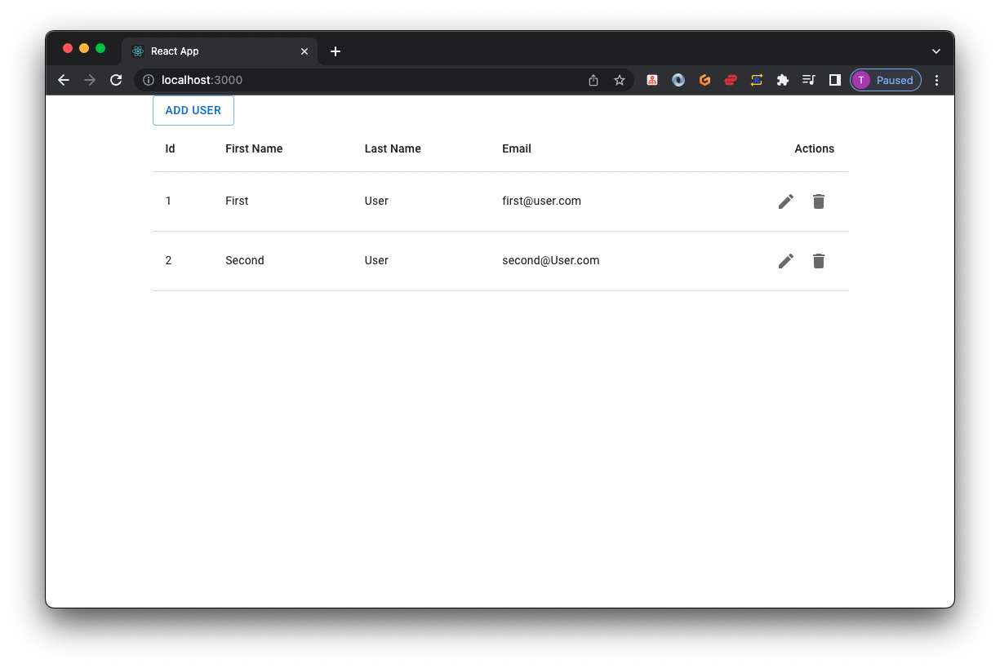

# Spring Boot React Full-Stack Architecture
## Part B the Client

Let's go ahead and create a React application to consume CRUD REST APIs.




Let's start with creating a React App using create-react-app CLI.


## 1. Create a React UI with Create React App

The Create React App CLI tool is an officially supported way to create single-page React applications. It offers a modern build setup with no configuration.

To create a new app, you may choose one of the following methods:

```
npx create-react-app employee-mgr-client
```

Running any of these commands will create a directory called employee-mgr-client inside the current folder. Inside that directory, it will generate the initial project structure and install the transitive dependencies:

```
employee-mgr-client
├── README.md
├── node_modules
├── package.json
├── .gitignore
├── public
│   ├── favicon.ico
│   ├── index.html
│   ├── logo192.png
│   ├── logo512.png
│   ├── manifest.json
│   └── robots.txt
└── src
    ├── App.css
    ├── App.js
    ├── App.test.js
    ├── index.css
    ├── index.js
    ├── logo.svg
    └── serviceWorker.js

```

Let's explore important files and folders of the react project.

For the project to build, these files must exist with exact filenames:

* public/index.html is the page template;
* src/index.js is the JavaScript entry point.

You can delete or rename the other files Let's quickly explore the project structure.

**package.json** - The package.json file contains all the required dependencies for our React JS project. Most importantly, you can check the current version of React that you are using. It has all the scripts to start, build, and eject our React app.

**public folder** - The public folder contains index.html. As react is used to build a single page application, we have this single HTML file to render all our components. Basically, it's an HTML template. It has a div element with id as root and all our components are rendered in this div with index.html as a single page for the complete react app.

**src folder**- In this folder, we have all the global javascript and CSS files. All the different components that we will be building, sit here.

**index.js** - This is the top renderer of your react app. 

**node_modules** - All the packages installed by NPM or Yarn will reside inside the node_modules folder.

**App.js** - The App.js file contains the definition of our App component which actually gets rendered in the browser and this is the root component.

## 2. Adding Mui  libs in React Using NPM

Open a terminal window in VSCODE, navigate to your project's folder, and run the following command:

Run these one at a time :

**MUI core libs**

```
npm install @mui/material @emotion/react @emotion/styled
```

**MUI Icons Lib**

```
npm install @mui/icons-material
```

## 3. EmployeeService - Consume CRUD REST API Call

For our API calls, we will be using Axios. Below is the npm command to install Axios.

**Axios**

```
npm install axios
```
Let's create a services folder inside the src folder and create a Javascript file named EmployeeService.js. Inside this file, create EmployeeService class with the following methods to make our HTTP REST call via Axios:

```
└── src
    ├── App.css
    ├── App.js
    ├── App.test.js
    ├── index.css
    ├── index.js
    ├── logo.svg
    └── serviceWorker.js
    └── services
        └── EmployeeService.js    
```

**EmployeeService.js**

```
import axios from 'axios';

const EMPLOYEE_BASE_API_URL = 'http://localhost:8081/api/v1/employees';

export function getAllEmployees(){
    return axios.get(EMPLOYEE_BASE_API_URL);
}

export function createEmployee(employee){
    return axios.post(EMPLOYEE_BASE_API_URL,employee);
}

export function getById(id){
    return axios.get(`${EMPLOYEE_BASE_API_URL}/${id}`);
}

export function updateEmployee(id, employee){
    return axios.put(`${EMPLOYEE_BASE_API_URL}/${id}`, employee);
}

export function deleteEmployee(id){
    return axios.delete(`${EMPLOYEE_BASE_API_URL}/${id}`);
}

```

## 4. package.json

This file contains all the required dependencies for our React JS project. Most importantly, you can check the current version of React that you are using. It has all the scripts to start, build, and eject our React app:

```
{
  "name": "employee-mgr-client",
  "version": "0.1.0",
  "private": true,
  "dependencies": {
    "@emotion/react": "^11.9.3",
    "@emotion/styled": "^11.9.3",
    "@mui/icons-material": "^5.8.4",
    "@mui/material": "^5.9.1",
    "@testing-library/jest-dom": "^5.16.4",
    "@testing-library/react": "^13.3.0",
    "@testing-library/user-event": "^13.5.0",
    "axios": "^0.27.2",
    "react": "^18.2.0",
    "react-dom": "^18.2.0",
    "react-router-dom": "^6.3.0",
    "react-scripts": "5.0.1",
    "web-vitals": "^2.1.4"
  },
  "scripts": {
    "start": "react-scripts start",
    "build": "react-scripts build",
    "test": "react-scripts test",
    "eject": "react-scripts eject"
  },
  "eslintConfig": {
    "extends": [
      "react-app",
      "react-app/jest"
    ]
  },
  "browserslist": {
    "production": [
      ">0.2%",
      "not dead",
      "not op_mini all"
    ],
    "development": [
      "last 1 chrome version",
      "last 1 firefox version",
      "last 1 safari version"
    ]
  }
}

```

## 5. React Employee Table Component

In this section, we will create a new folder called components inside the src folder. Then create a new file called ListEmployeeComponent.js. 

```
└── src
    ├── App.css
    ├── App.js
    ├── App.test.js
     └── components
     	 └── EmployeeTable.js
    ├── index.css
    ├── index.js
    ├── logo.svg
    └── serviceWorker.js
    └── services
        └── EmployeeService.js    
```

**EmployeeTable**

```
import { useEffect, useState} from 'react';
import EditIcon from '@mui/icons-material/Edit';
import DeleteIcon from '@mui/icons-material/Delete';
import {useNavigate } from "react-router-dom";
import * as employeeService from '../services/EmployeeService';
import {
    IconButton,
    Table,
    TableBody,
    TableCell,
    TableHead,
    TableRow,
  } from '@mui/material';
  
export const EmployeeTable = () => {
    const [employees, setEmployees]= useState([]);
    const navigate = useNavigate();

    useEffect(()=> {
        employeeService.getAllEmployees()
        .then(res => {
            setEmployees(res.data);
        })
    }, [])
    const goToUpdate = (id) => {
        navigate(`/${id}`);
    }

    const deleteEmployee = (id) => {
        console.log(id);
    }

    return (
        <div >
            <Table sx={{minWidth:700}}>
                <TableHead sx={{}}>
                <TableRow>
                    <TableCell>
                        Id
                    </TableCell>                        
                    <TableCell>
                        First Name
                    </TableCell>
                    <TableCell>
                        Last Name
                    </TableCell>
                    <TableCell>
                        Email
                    </TableCell>
                    <TableCell align="right">
                        Actions
                    </TableCell>
                </TableRow>
                </TableHead>
                <TableBody>
                    {
                        employees.map((employee)=> {
                            return(
                                <TableRow
                                    hover
                                    key={employee.id}
                                >
                                    <TableCell>
                                        {employee.id}
                                    </TableCell>
                                    <TableCell>
                                        {employee.firstName}
                                    </TableCell>
                                    <TableCell>
                                        {employee.lastName}
                                    </TableCell>
                                    <TableCell>
                                        {employee.email}
                                    </TableCell>
                                    <TableCell align="right">
                                        <IconButton component="a" onClick={()=> goToUpdate(employee.id)}>
                                            <EditIcon />
                                        </IconButton>
                                        <IconButton component="a" onClick={()=> deleteEmployee(employee.id)}>
                                            <DeleteIcon />
                                        </IconButton>
                                    </TableCell>
                                </TableRow>
                            ) 
                        })
                    }
                </TableBody>
            </Table>
        </div>
    )
}
```

Let's understand the React Hooks used in the above code snippet.

### useState() hook

The useState is a Hook (function) that allows you to have state variables in functional components. You pass the initial state to this function and it returns a variable with the current state value (not necessarily the initial state) and another function to update this value.

```
const [employees, setEmployees]= useState([]);
```

### useEffect() hook

The useEffect Hook allows us to perform side effects (an action) in the function components. It does not use components lifecycle methods that are available in class components. 

We are using the ES6 feature that is map operator to loop over our employees list and create the view:

```
<TableBody>
    {
        employees.map((employee)=> {
            return(
                <TableRow
                    hover
                    key={employee.id}
                >
                    <TableCell>
                        {employee.id}
                    </TableCell>
                    <TableCell>
                        {employee.firstName}
                    </TableCell>
                    <TableCell>
                        {employee.lastName}
                    </TableCell>
                    <TableCell>
                        {employee.email}
                    </TableCell>
                    <TableCell align="right">
                        <IconButton component="a" onClick={()=> goToUpdate(employee.id)}>
                            <EditIcon />
                        </IconButton>
                        <IconButton component="a" onClick={()=> deleteEmployee(employee.id)}>
                            <DeleteIcon />
                        </IconButton>
                    </TableCell>
                </TableRow>
            ) 
        })
    }
</TableBody>
```

With the click of the Delete button, the below function will make an API call to delete an Employee record from the database:

```
function deleteEmployee (id){
    employeeService.deleteEmployee(id)
    .then(()=>{
        requestDataFromApi();
    })
}
```

With the click of the Update button, we will navigate to the Update Employee page using the following code:

```
const navigate = useNavigate();

...

function goToUpdate(id){
    navigate(`/${id}`);
}

...

<IconButton component="a" onClick={()=> goToUpdate(employee.id)}>
    <EditIcon />
</IconButton>
```

## 7. Configure Routing

To use React Router, you first have to install it using NPM:
**React Router Dom**

```
npm install react-router-dom
```

Let's open the App component and configure routing. We use the Switch element (open and closing tags) these ensure that only one component is rendered at a time.

Replace the App component with the following code:

**App.js**

```
import { BrowserRouter, Routes, Route } from "react-router-dom";
import {Container} from '@mui/material';
import {Employee} from "./pages/Employee";
import {NoContent} from "./pages/NoContent";
import {Update} from "./pages/Update";
import {Add} from "./pages/Add";
function App() {

  return (
    <Container maxWidth="md">
      <BrowserRouter>
        <Routes>
          <Route path="/" element={<Employee />} />
          <Route path="/update/:id" element={<Update />} />
          <Route path="/add" element={<Add />} />
          <Route path="*" element={<NoContent />} />
        </Routes>
      </BrowserRouter>
     
    </Container>
  );
}

export default App;

```

## 8. Add all Pages
So the pages we will be creating are as follows in a `pages` directory :

* Add.js
* Employee.js
* NoContent.js
* Update.js

```
└── src
    ├── App.css
    ├── App.js
    ├── App.test.js
     └── components
     	 └── EmployeeTable.js
    ├── index.css
    ├── index.js
    ├── logo.svg
    └── serviceWorker.js
    └── services
        └── EmployeeService.js
    └── pages
    	└── Add.js
    	└── Employee.js
    	└── NoContent.js
    	└── Update.js    
```

**Add.js**

```
import { useParams } from "react-router-dom";
import { useState } from "react";
import * as React from 'react';
import Button from '@mui/material/Button';
import CssBaseline from '@mui/material/CssBaseline';
import TextField from '@mui/material/TextField';
import Grid from '@mui/material/Grid';
import Box from '@mui/material/Box';
import Typography from '@mui/material/Typography';
import Container from '@mui/material/Container';
import { createTheme, ThemeProvider } from '@mui/material/styles';
import * as employeeService from '../services/EmployeeService';
import {useNavigate } from "react-router-dom";

const theme = createTheme();

export function Add() {
  const navigate = useNavigate();
  const {id} = useParams();
  const [firstName, setFirstName] = useState('')
  const [lastName, setLastName] = useState('')
  const [email, setEmail] = useState('')

  const handleSubmit = (event) => {
    event.preventDefault();
    const data = new FormData(event.currentTarget);
    const employee = {
      firstName: data.get('firstName'),
      lastName: data.get('lastName'),
      email:data.get('email')
    };

    employeeService.createEmployee(employee)
    .then(response => {
      navigate("/");
    })

  };

    return(
     <ThemeProvider theme={theme}>
      <Container component="main" maxWidth="xs">
        <CssBaseline />
        <Box
          sx={{
            marginTop: 8,
            display: 'flex',
            flexDirection: 'column',
            alignItems: 'center',
          }}
        >
          <Typography component="h1" variant="h5">
            Add
          </Typography>
          <Box component="form" noValidate onSubmit={handleSubmit} sx={{ mt: 3 }}>
            <Grid container spacing={2}>
              <Grid item xs={12} sm={6}>
                <TextField
                  autoComplete="given-name"
                  name="firstName"
                  required
                  fullWidth
                  value={firstName}
                  onChange= {(e) => setFirstName(e.target.value)}
                  id="firstName"
                  label="First Name"
                  autoFocus
                />
              </Grid>
              <Grid item xs={12} sm={6}>
                <TextField
                  required
                  fullWidth
                  id="lastName"
                  value={lastName}
                  onChange= {(e) => setLastName(e.target.value)}
                  label="Last Name"
                  name="lastName"
                  autoComplete="family-name"
                />
              </Grid>
              <Grid item xs={12}>
                <TextField
                  required
                  fullWidth
                  id="email"
                  value={email}
                  onChange= {(e) => setEmail(e.target.value)}
                  label="Email Address"
                  name="email"
                  autoComplete="email"
                />
              </Grid>

            </Grid>
            <Button
              type="submit"
              fullWidth
              variant="contained"
              sx={{ mt: 3, mb: 2 }}
            >
             Save
            </Button>

          </Box>
        </Box>
      </Container>
    </ThemeProvider>
    )
  };
```

**Employee.js**

```
import {EmployeeTable} from "../components/EmployeeTable";
import Button from '@mui/material/Button';
import {useNavigate } from "react-router-dom";

export const Employee =() => {
    const navigate = useNavigate();

    function addUser(){
        navigate("/add")
    }

    return(
        <>
            <Button variant="outlined" onClick={e => addUser()}>Add User</Button>
            <EmployeeTable />
        </>
    )
}

```

**NoContent.js**

```
export const NoContent = () => {
  return <h1>404</h1>;
};
```

**Update.js**

```
import { useParams } from "react-router-dom";
import { useEffect, useState } from "react";
import * as React from 'react';
import Button from '@mui/material/Button';
import CssBaseline from '@mui/material/CssBaseline';
import TextField from '@mui/material/TextField';
import Grid from '@mui/material/Grid';
import Box from '@mui/material/Box';
import Typography from '@mui/material/Typography';
import Container from '@mui/material/Container';
import { createTheme, ThemeProvider } from '@mui/material/styles';
import * as employeeService from '../services/EmployeeService';

import {useNavigate } from "react-router-dom";

const theme = createTheme();

export const Update = () => {
  const navigate = useNavigate();
  const {id} = useParams();
  const [firstName, setFirstName] = useState('')
  const [lastName, setLastName] = useState('')
  const [email, setEmail] = useState('')

  useEffect(()=> {
    employeeService.getById(id)
    .then(response => {
       const user = response.data;
       setFirstName(user.firstName);
       setLastName(user.lastName);
       setEmail(user.email);
    })
  },[]);

  const handleSubmit = (event) => {
    event.preventDefault();
    const data = new FormData(event.currentTarget);
    const employee = {
      firstName: data.get('firstName'),
      lastName: data.get('lastName'),
      email:data.get('email')
    };

    employeeService.updateEmployee(id,employee)
    .then(response => {
      navigate("/");
    })

  };

    return(
     <ThemeProvider theme={theme}>
      <Container component="main" maxWidth="xs">
        <CssBaseline />
        <Box
          sx={{
            marginTop: 8,
            display: 'flex',
            flexDirection: 'column',
            alignItems: 'center',
          }}
        >
          <Typography component="h1" variant="h5">
            Update
          </Typography>
          <Box component="form" noValidate onSubmit={handleSubmit} sx={{ mt: 3 }}>
            <Grid container spacing={2}>
              <Grid item xs={12} sm={6}>
                <TextField
                  autoComplete="given-name"
                  name="firstName"
                  required
                  fullWidth
                  value={firstName}
                  onChange= {(e) => setFirstName(e.target.value)}
                  id="firstName"
                  label="First Name"
                  autoFocus
                />
              </Grid>
              <Grid item xs={12} sm={6}>
                <TextField
                  required
                  fullWidth
                  id="lastName"
                  value={lastName}
                  onChange= {(e) => setLastName(e.target.value)}
                  label="Last Name"
                  name="lastName"
                  autoComplete="family-name"
                />
              </Grid>
              <Grid item xs={12}>
                <TextField
                  required
                  fullWidth
                  id="email"
                  value={email}
                  onChange= {(e) => setEmail(e.target.value)}
                  label="Email Address"
                  name="email"
                  autoComplete="email"
                />
              </Grid>

            </Grid>
            <Button
              type="submit"
              fullWidth
              variant="contained"
              sx={{ mt: 3, mb: 2 }}
            >
             Save
            </Button>

          </Box>
        </Box>
      </Container>
    </ThemeProvider>
    )
  };
```